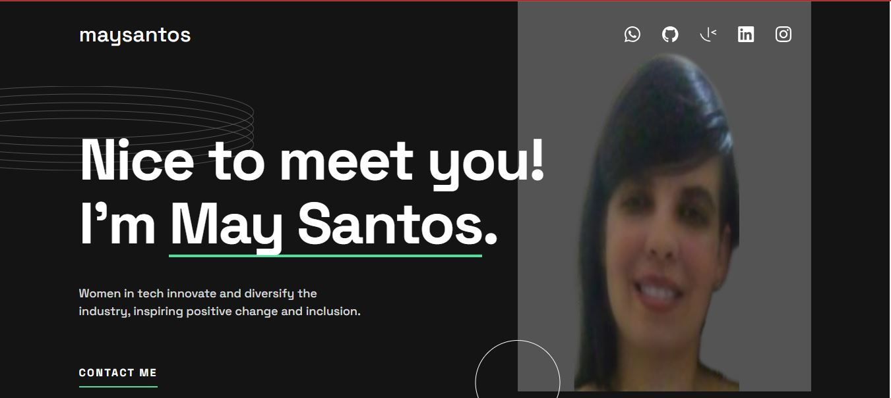

# modulo-Front-End-Projeto-final-html

### 
 [Acesse aqui](https://portfolio-may-dev.netlify.app/)

 

#

Esse portfólio é criado nas aulas do modulo de Front End em HTML E CSS.

https://www.frontendmentor.io/challenges/singlepage-developer-portfolio-bBVj2ZPi-x
O desafio é construir esse portfólio de página única e fazer com que pareça o mais próximo possível do design.
pode usar qualquer ferramenta que desejar para ajudá-lo a completar o desafio. 
Então, se você tem algo que gostaria de praticar, sinta-se à vontade para tentar.

Seus usuários devem ser capazes de:

Receba uma mensagem de erro quando o formulário for enviado se: Qualquer campo está vazio O endereço de e-mail não está formatado corretamente Veja o layout ideal para a interface dependendo do tamanho da tela do dispositivo Veja os estados de foco e foco de todos os elementos interativos na página

Bônus: conecte o formulário para enviar e armazenar a consulta do usuário (você pode usar uma planilha ou Airtable para salvar as consultas) Bônus: adicione seus próprios detalhes (imagem, habilidades, projetos) para substituir os do design

